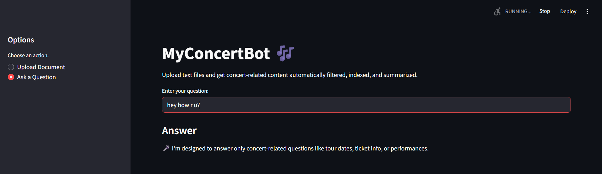
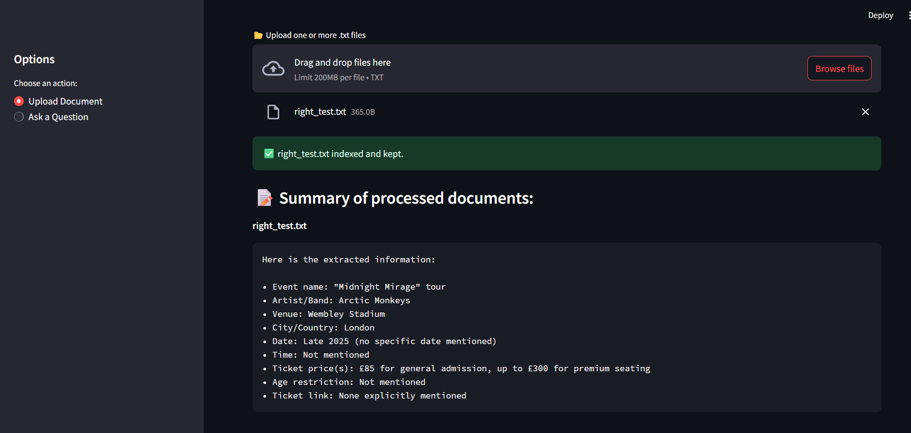
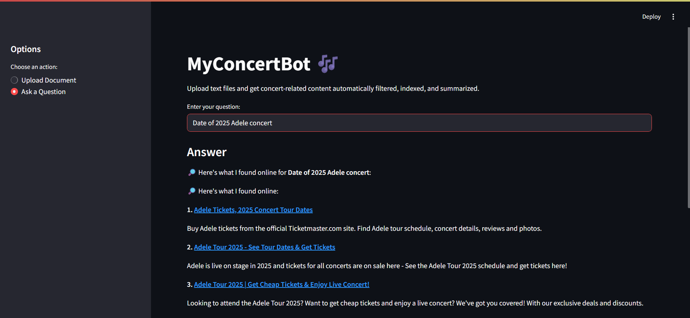

# MyConcertBot 🎶

**MyConcertBot** is an intelligent assistant that helps you process, filter, and answer concert-related questions using your own documents and fallback online search. Built with LangChain, FAISS, Ollama, and Streamlit, it showcases a real-world Retrieval-Augmented Generation (RAG) pipeline with topic filtering and live web fallback.

---

## 📸 Screenshots

### Asking not Concert-related Question


### Uploading Concert Documents


### Online Search Fallback (When FAISS Fails)


---

## 🚀 Features

* Upload `.txt` documents and automatically index only **concert-related** content
* Ask concert-related questions (e.g. tour dates, venues, ticket prices)
* If answer not found locally, the bot uses **online search fallback**
* Built with modular, production-ready code

---

## ⚙️ Installation & Setup

### 1. Clone the repository

```bash
git clone https://github.com/your-username/MyConcertBot.git
cd MyConcertBot
```

### 2. Set up Python environment

```bash
python -m venv venv
source venv/bin/activate  # or venv\Scripts\activate on Windows
pip install -r requirements.txt
```

### 3. Add environment variables

Create a `.env` file in the root of the project and add:

```env
SERPAPI_API_KEY=your_key_here
```

This key is used for online fallback search when no relevant data is found locally.

You can also specify a custom FAISS path:

```env
FAISS_DB_DIR=faiss_db
```

> **Important**: The `.env` file is already ignored in `.gitignore` and will not be uploaded to GitHub.

---

## 📂 How to Use

### Upload Documents:

1. Run the app:

   ```bash
   streamlit run main.py
   ```
2. In the UI, choose "Upload Document"
3. Upload `.txt` files — non-concert content is filtered out

### Ask Questions:

1. Select "Ask a Question"
2. Type questions like:

   * "Where is Dua Lipa performing in 2025?"
   * "What are the ticket prices for Taylor Swift concerts?"

If local data can't answer the query, MyConcertBot searches online automatically.

---

## 📊 Technologies Used

* **LangChain** for chaining LLM + retrieval logic
* **FAISS** for fast document vector search
* **Ollama + Llama3** for offline LLM capabilities
* **Streamlit** for interactive UI
* **Custom Filters** for concert-topic detection
* **Fallback Search** via SerpAPI or web scraping

---

## 🔍 Example Use Case

* Upload a `.txt` file containing a scraped tour schedule
* Ask: *"When is the Imagine Dragons concert in Berlin?"*
* If not found locally, it triggers an online search

---

## ⚠️ Notes

* Only supports `.txt` files
* Questions must be **concert-related** (automatically filtered)
* FAISS index is regenerated on new uploads
* GPU FAISS is not required

---

## 🚜 Deployment Suggestion

This project can be deployed locally or via services like **Streamlit Cloud**, **Docker**, or even **Hugging Face Spaces** with minor modifications.

---

## 🚀 Future Improvements

* Support PDFs or other file formats
* User login for persistent session history
* Better LLM fallback fine-tuning

---

## 💪 Credits

Built with ❤️ by Garnik. Part of ML/AI engineering portfolio.

---

## 📦 Folder Structure Overview

```
MyConcertBot/
├── main.py                  # Streamlit UI
├── qa_system.py             # RAG logic with FAISS + fallback
├── llm_utils.py             # LLM summarization utils
├── filter_docs.py           # Concert-topic filter
├── online_lookup.py         # Online search logic
├── requirements.txt         # Dependencies
├── README.md                # Project info
├── .gitignore               # Ignore index + cache
```

---
